# DevOps Take-Home — Architecture & Walkthrough

Structured against the 7-part brief. Each section ties deliverables in this repo
to evidence captured from the live deployment.

---

## 1. Setup & Plan

### High-level architecture

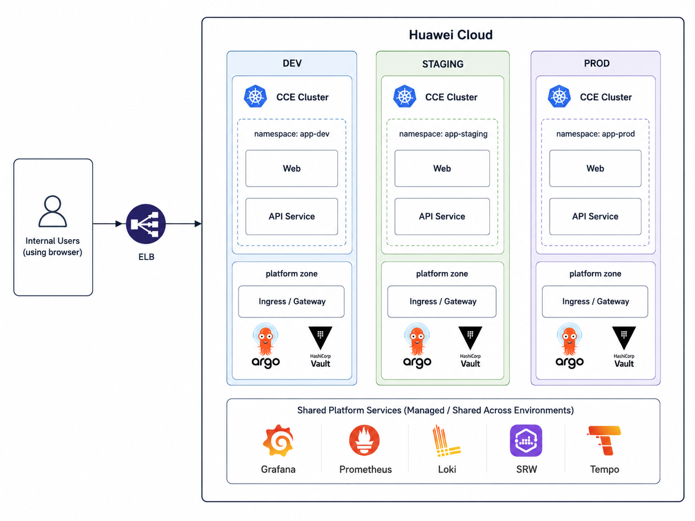

Three CCE clusters (dev / staging / prod) on Huawei Cloud, each running an
identical workload stack:

- **App tier** — frontend (React + nginx) + backend (Node.js + Express, blue/green)
- **Platform tier** — Envoy Gateway, Argo CD, Argo Rollouts, Vault
- **Shared services** — Grafana, Prometheus, Loki, SWR (registry), Tempo

### Tech stack

| Layer | Tech |
|---|---|
| Backend | Node.js 20, Express, `prom-client`, `pino`, OpenTelemetry |
| Frontend | React 18 + Vite, served by `nginxinc/nginx-unprivileged` |
| Containerization | Docker BuildKit, multi-stage, Alpine + non-root |
| Registry | Huawei SWR (org: `devops-demo`) |
| Compute | Huawei CCE (managed Kubernetes 1.33) |
| Networking | Huawei VPC + ELB + EIP, Envoy Gateway (HTTPRoute) |
| IaC | Terraform 1.9, modular, OBS S3-compatible remote backend |
| CI/CD | GitLab CI (app + infra pipelines) |
| GitOps | Argo CD (per-service Applications) |
| Deployment strategy | Argo Rollouts — blue/green with manual promote |
| Metrics | Prometheus (kube-prometheus-stack) |
| Logs | Loki + Grafana Alloy |
| Traces | Tempo (OTLP gRPC/HTTP) |
| Alerts | Alertmanager → **Discord webhook** |
| Secrets | HashiCorp Vault + Vault Secrets Operator |
| Security | Non-root containers, read-only FS, NetworkPolicy default-deny, Trivy scans |

---

## 2. Infrastructure as Code

All Huawei Cloud resources are provisioned with Terraform under
`infrastructure/terraform/`. Modular, with environment overlays for
`staging` and `production`.

### Module structure

```text
infrastructure/terraform/
├── bootstrap/             one-time OBS bucket + state lock setup
├── envs/
│   ├── staging/           env-specific composition
│   └── production/
└── modules/
    ├── vpc/               VPC, subnets, NAT
    ├── cce/               CCE cluster + node pool
    ├── elb/               Dedicated ELB + EIP
    ├── swr/               SWR org + repos
    ├── obs-backend/       Terraform state bucket
    ├── private-dns/       internal zones
    └── argocd-bootstrap/  Argo CD install + repo creds
```

### Remote state (OBS, S3-compatible)

Terraform state lives in an OBS bucket with versioning, separate prefix per env.

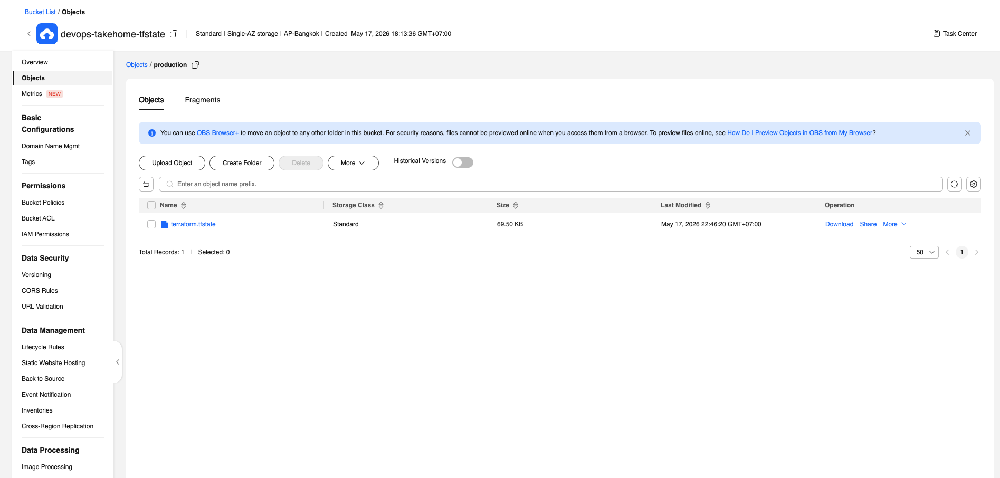

### Cluster provisioned

After `terraform apply` in production:

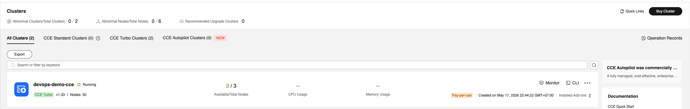

### Networking — EIP + ELB

Public EIP bound to a dedicated ELB (terminates TLS, fronts the cluster):

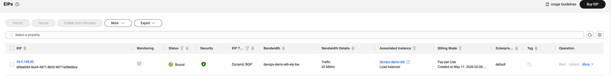

### Apply output

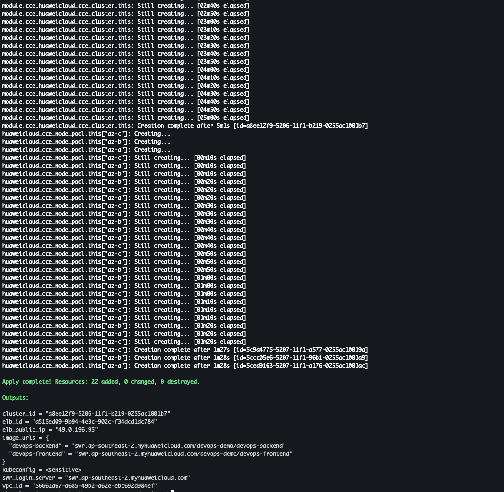

### Cloud resource inventory

| Layer | Resource | Module | Spec (production) | Spec (staging) |
|---|---|---|---|---|
| **State** | OBS bucket | `obs-backend` | 1 bucket, versioned | shared |
| **Network** | VPC | `vpc` | `10.20.0.0/16` | `10.10.0.0/16` |
| **Network** | Subnets | `vpc` | 3× /24 across 3 AZ | 2× /24 across 2 AZ |
| **Network** | NAT Gateway | `vpc` | 1× standard | 1× small |
| **Edge** | EIP | `elb` | 20 Mbps | 5 Mbps |
| **Edge** | ELB (dedicated) | `elb` | cross-AZ, L7 | cross-AZ, L7 |
| **Compute** | CCE control plane | `cce` | `cce.s2.medium` HA 3-master | `cce.s1.small` single |
| **Compute** | CCE node pool (ECS) | `cce` | 3× s6.xlarge.2 (3→8 autoscale) | 2× s6.xlarge.2 (2→4) |
| **Storage** | ECS data disk | `cce` | 100 GB SSD per node | 100 GB SSD per node |
| **Registry** | SWR organization | `swr` | `devops-demo` | shared |
| **Registry** | SWR repos | `swr` | `devops-backend`, `devops-frontend` (retention=10) | shared |

---

## 3. Application Containerization

Two services, both in `demo-application/`. Each ships a multi-stage `Dockerfile`
with BuildKit cache mounts.

### Backend (`demo-application/backend/`)

Node.js 20 + Express, exposes `/healthz`, `/readyz`, `/metrics` (Prometheus),
sends OTLP traces to Tempo.

Dockerfile stages:

```text
deps         → npm ci --include=dev          (cache: /root/.npm)
test         → npm test                      (runs in CI only)
prod-deps    → npm ci --omit=dev             (slimmer)
runtime      → node:20-alpine + tini + curl  (non-root, read-only rootfs)
```

Final image: ~80 MB. Healthcheck: `curl -fsS http://127.0.0.1:8080/healthz`.

### Frontend (`demo-application/frontend/`)

React 18 + Vite, built and served by `nginxinc/nginx-unprivileged:1.27-alpine`.

```text
builder      → node:20-alpine, npm ci + npm run build → /app/dist
runtime      → nginx-unprivileged, serves /usr/share/nginx/html
```

Final image: ~45 MB. Runs as UID 101 (non-root), `readOnlyRootFilesystem: true`
with `emptyDir` mounts at `/var/cache/nginx`, `/var/run`, `/etc/nginx/conf.d`,
`/tmp`.

### Registry

Both images are pushed to `swr.ap-southeast-2.myhuaweicloud.com/devops-demo/`:

- `devops-backend:dev`, `devops-backend:vX.Y.Z`, `devops-backend:latest`
- `devops-frontend:dev`, `devops-frontend:vX.Y.Z`, `devops-frontend:latest`

CI build forces `--provenance=false --sbom=false --platform linux/amd64` so
SWR (which doesn't understand OCI multi-manifest attestations) can accept the
push.

---

## 4. CI/CD Pipeline

End-to-end flow from developer commit to running pod:

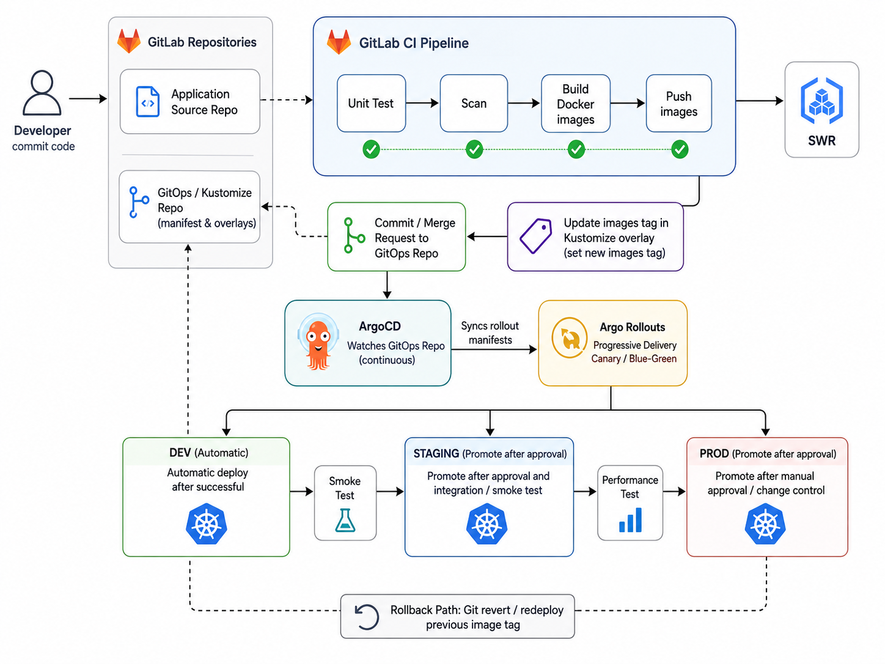

### App pipeline — `infrastructure/cicd/demo/gitlab-ci.yml`

Stages:

```text
install → lint → test → build → build-docker-{dev,prod} → sonar → container-scanning
```

| Trigger | What runs | SWR image written |
|---|---|---|
| MR to `dev` / `main` | install + lint + test | — |
| push to `dev` | test → build → docker push `dev` + `<sha8>` → Trivy scan | `swr/devops-demo/<proj>:dev` + `:<sha8>` |
| push to `main` | install + lint + test only | — |
| git tag `vX.Y.Z` on `main` | test → build → docker push `vX.Y.Z` + `latest` → Trivy scan | `swr/devops-demo/<proj>:vX.Y.Z` + `:latest` |

Each project's own `.gitlab-ci.yml` is a one-liner that `include:` the shared
template and overrides `IMAGE_NAME`:

```yaml
# demo-application/backend/.gitlab-ci.yml
variables:
  IMAGE_NAME: devops-backend
include:
  - project: 'infrastructure/cicd'
    file: 'demo/gitlab-ci.yml'
```

### Infra pipeline — `infrastructure/cicd/infra/gitlab-ci.yml`

| Trigger | What runs |
|---|---|
| MR | `fmt` + `validate` + `plan` (staging & production) |
| push to `dev` | `apply` staging (**automatic**) |
| push to `main` | `apply` production (**manual gate** in GitLab UI) |

### GitOps — Argo CD picks up from here

After CI pushes a new image tag and (optionally) the kustomize overlay's
`images.newTag` is bumped, Argo CD reconciles the cluster.

Per-service Applications under `infrastructure/gitops/argocd/`:

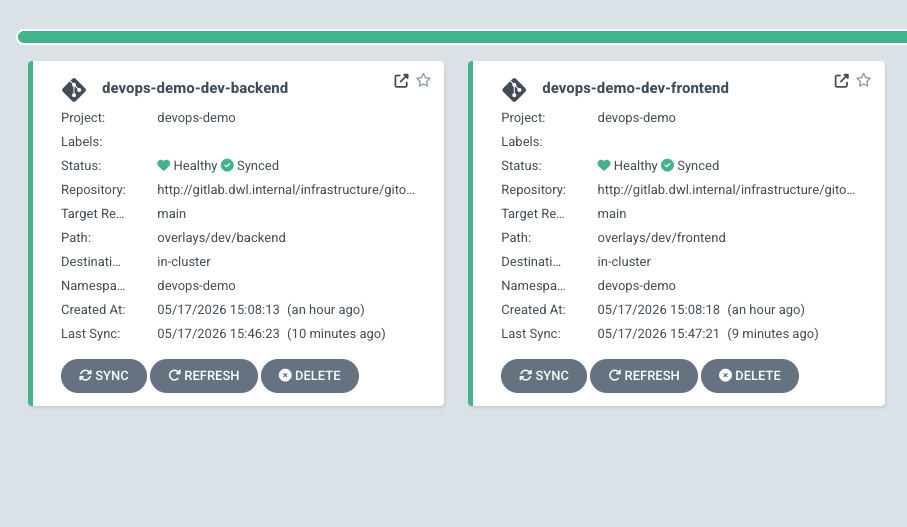

Platform infrastructure (Envoy Gateway, Vault, VSO, routes) also managed
GitOps-style:

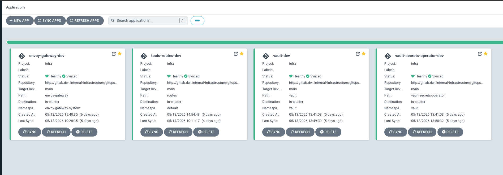

### Branch / environment summary

```text
   feature-branch ──MR──► dev   → CI builds dev image → Argo CD auto-syncs dev
   dev            ──MR──► main  → CI tests only
   main           ──tag──► vX.Y.Z → CI builds prod image → Argo CD prod (manual sync)
```

Rollback = `git revert` the kustomize commit, OR change `newTag` in overlay
back to a previous version — Argo CD reconciles automatically.

---

## 5. Kubernetes Deployment

### Kustomize layout

```text
infrastructure/gitops/kustomize/
├── base/
│   ├── backend/     Rollout (blue/green), Service, Service preview, HPA, PDB, SA
│   ├── frontend/    Deployment, Service, HPA, PDB
│   └── shared/      NetworkPolicies (7 rules)
└── overlays/
    ├── dev/         namespace devops-demo + dev images + replica=1 + dev hostnames
    │   ├── backend/   configmap.env, secret (VaultStaticSecret), HTTPRoute, patches
    │   ├── frontend/  configmap.env, HTTPRoute, patches
    │   └── shared/    namespace + ingress-patch (host)
    └── prod/        namespace + prod images + replica=3 + prod hostnames
```

### Blue/green via Argo Rollouts

The backend is a `Rollout` (not a `Deployment`) with `blueGreen` strategy:

```yaml
strategy:
  blueGreen:
    activeService: backend
    previewService: backend-preview
    autoPromotionEnabled: false   # manual promote
    scaleDownDelaySeconds: 30
```

Two Services exist permanently:

- `backend` — live traffic, selector managed by Argo Rollouts
- `backend-preview` — smoke-test the candidate ReplicaSet before promote

Promote with `kubectl argo rollouts promote backend -n devops-demo` (or the
button in Argo Rollouts dashboard). Rollback = `argo rollouts undo`.

### Traffic routing (Gateway API + Envoy Gateway)

Per-service `HTTPRoute` in each overlay:

- backend: `<env>-api-backend.dwl.internal` → `Service backend:8080`
- frontend: `<env>-app.dwl.internal` → `Service frontend:80`

Plus `BackendTrafficPolicy` (timeouts + Gzip) and `SecurityPolicy` (CORS)
attached to each route.

### Pods running on the cluster

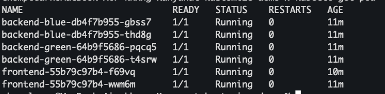

Two `backend-blue` + two `backend-green` (both colors live at all times for
instant cut-over), plus two `frontend` (HPA-managed, min 2).

### Cluster guardrails (in base)

| Resource | Purpose |
|---|---|
| `HPA` (cpu+mem) | min=1/max=2 in dev, min=2/max=6 in prod |
| `PodDisruptionBudget` | `minAvailable: 1` for backend + frontend |
| `NetworkPolicy default-deny` | block all egress/ingress by default |
| `NetworkPolicy allow-frontend-to-backend` | scoped frontend→backend |
| `NetworkPolicy allow-gateway-to-{backend,frontend}` | only Envoy Gateway can reach pods |
| `NetworkPolicy allow-backend-to-{vault,tempo}` | egress allow-list |
| `imagePullSecrets: swr-pull-secret` | SWR docker auth |
| `securityContext` | `runAsNonRoot`, `readOnlyRootFilesystem`, `drop ALL caps` |

### Config and secrets

- **ConfigMaps** — generated by Kustomize `configMapGenerator` from
  `overlays/<env>/<svc>/configmap.env` (env-specific overrides merged on top of
  base defaults).
- **Secrets** — `VaultStaticSecret` CR (Vault Secrets Operator) syncs Vault KV
  to a K8s Secret named `backend-secrets`, mounted via `envFrom`.

---

## 6. Observability

### Stack overview

| Signal | Tool | Source |
|---|---|---|
| Metrics | Prometheus (kube-prometheus-stack) | `/metrics` on backend, cAdvisor, kube-state-metrics |
| Logs | Loki + Grafana Alloy (DaemonSet) | container stdout JSON |
| Traces | Tempo (OTLP HTTP `:4318`) | backend OpenTelemetry SDK |
| Dashboards | Grafana with provisioned datasources | Loki + Tempo linked via `derivedFields` (log→trace), Tempo→Loki via `tracesToLogsV2` |
| Alerts | Alertmanager → Discord webhook | `PrometheusRule` CRs |

### Alert rules (defined in `kube-prometheus-stack/values-custom.yaml`)

| Alert | Severity | Triggers when |
|---|---|---|
| `PodCrashLooping` | critical | restart count > 3 in 10 min |
| `PodNotReady` | warning | pod stays non-Running for 5 min |
| `PodOOMKilled` | critical | container terminated with reason OOMKilled |
| `PodImagePullFailing` | warning | `ImagePullBackOff` / `ErrImagePull` for 5 min |
| `HighCPUUsage` | warning | cpu > 85% of limit for 10 min |
| `HighMemoryUsage` | warning | mem > 90% of limit for 10 min |
| `BackendHighErrorRate` | critical | 5xx rate > 5% for 5 min |
| `BackendLatencyP95High` | warning | p95 > 1s for 10 min |
| `BackendDown` | critical | scrape target down for 2 min |

### Routing → Discord

Alertmanager routes `severity: critical` to a `discord-critical` receiver
(`@here` mention + 🚨 emoji) and everything else to `discord-default`. Both
post to the same webhook with different message templates:

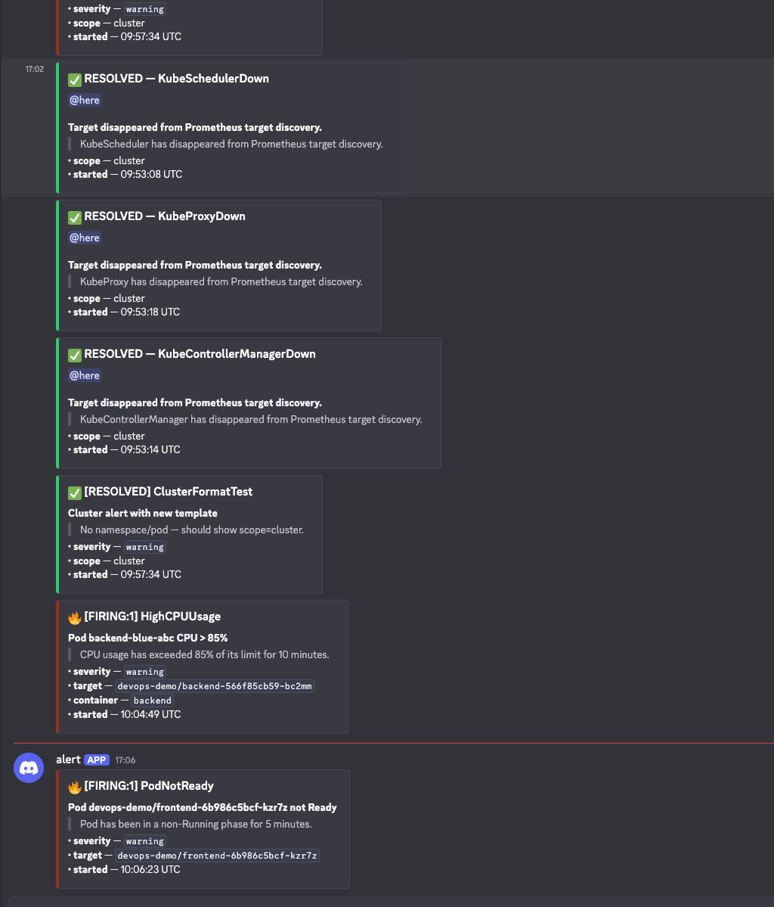

Each notification contains:

- title with status, count, alert name (`🔥 [FIRING:1] HighCPUUsage`)
- summary + description (as blockquote)
- conditional bullets — `severity`, `target` (`namespace/pod`), `container`,
  `node`, `started` — skipped when label is empty (cluster-level alerts
  cleanly show `scope — cluster` instead of an empty `namespace:`)

### Pre-flight noise reduction

Default `kube-prometheus-stack` rules that target the Huawei-managed control
plane (`KubeSchedulerDown`, `KubeControllerManagerDown`, `KubeProxyDown`,
`KubeEtcdDown`) are disabled in `values-custom.yaml` — those endpoints aren't
scrapable in CCE and were firing as false positives.

---

## 7. Documentation & Demo

### Frontend UI

The frontend pulls `/api/info` from the backend and renders the active
color (blue vs green) — useful for visually confirming a Rollout promote:

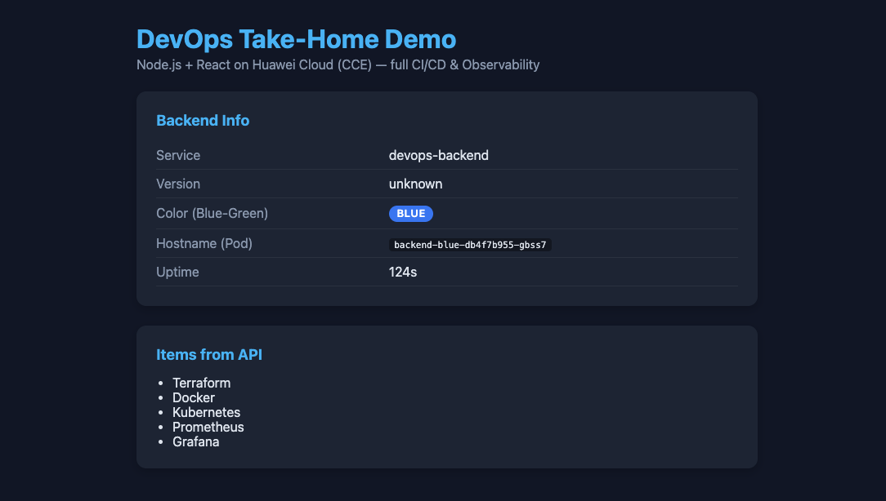

### Repository layout

```text
demo-application/                         app source
  ├─ backend/        Node.js + Express
  └─ frontend/       React + Vite

infrastructure/
  ├─ cicd/           GitLab CI shared templates
  │   ├─ demo/       app pipeline (Node)
  │   └─ infra/      Terraform pipeline
  ├─ gitops/
  │   ├─ argocd/     Argo CD Applications + Project + repo secret
  │   ├─ kustomize/  base/ + overlays/{dev,prod}/{backend,frontend,shared}/
  │   └─ tools/      Helm chart customizations (Argo Rollouts, observability stack)
  └─ terraform/      modules/ + envs/{staging,production}/

docs/
  ├─ architecture.md  this file
  └─ images/
```

### Deploy / verify quick reference

```bash
# Terraform — provision Huawei Cloud
cd infrastructure/terraform/envs/production
terraform init
terraform apply

# Install platform add-ons
helm install argo-rollouts   infrastructure/gitops/tools/argo-rollouts \
  -n argo-rollouts --create-namespace \
  -f infrastructure/gitops/tools/argo-rollouts/values-custom.yaml

helm upgrade --install kps   infrastructure/gitops/tools/observability/helm-tools/kube-prometheus-stack \
  -n monitoring --create-namespace \
  -f infrastructure/gitops/tools/observability/helm-tools/kube-prometheus-stack/values-custom.yaml

# Register apps with Argo CD
kubectl apply -f infrastructure/gitops/argocd/repo-secret.yaml
kubectl apply -f infrastructure/gitops/argocd/project.yaml
kubectl apply -f infrastructure/gitops/argocd/app-dev-shared.yaml
kubectl apply -f infrastructure/gitops/argocd/app-dev-backend.yaml
kubectl apply -f infrastructure/gitops/argocd/app-dev-frontend.yaml

# Verify
kubectl get application -n argocd
kubectl get rollout,deploy,svc,httproute -n devops-demo
kubectl argo rollouts get rollout backend -n devops-demo

# Trigger a test alert end-to-end
kubectl port-forward -n monitoring svc/kps-alertmanager 9093:9093 &
curl -X POST http://localhost:9093/api/v2/alerts -H 'Content-Type: application/json' \
  -d '[{"labels":{"alertname":"SmokeTest","severity":"critical","namespace":"devops-demo","pod":"x"},
       "annotations":{"summary":"smoke","description":"verify Discord pipeline"}}]'
```
