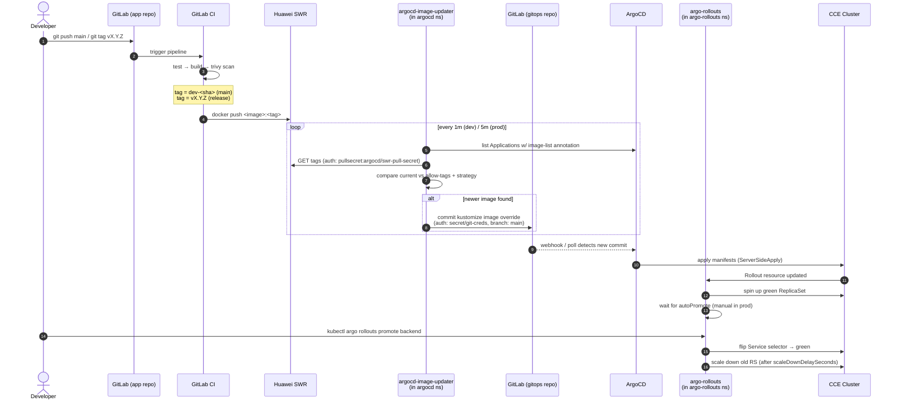

# CI/CD Flow — End-to-End

How a code change reaches the cluster. Maps to the real config in this repo:
GitLab CI → SWR registry → argocd-image-updater → Git write-back → ArgoCD sync
→ argo-rollouts (BlueGreen for backend).

---

## Repos involved

| Repo | Role |
|---|---|
| `demo-application/backend`, `demo-application/frontend` | App source + `.gitlab-ci.yml` |
| `infrastructure/gitops/kustomize-demo` (this repo) | ArgoCD Applications, Kustomize base + overlays, Helm charts |
| `swr.ap-southeast-2.myhuaweicloud.com/devops-demo/*` | Container registry (Huawei SWR) |

CI **never** pushes to the gitops repo. Image promotion is done in-cluster by
argocd-image-updater. This keeps the deploy contract minimal and means
revoking the GitLab CI token cannot push bad YAML.

---

## Tag contract (the only coupling between CI and CD)

| Env | Branch / trigger | Tag pushed | Image-updater strategy |
|---|---|---|---|
| dev | push to `main` | `dev-<short-sha>` (+ `:latest` for frontend) | `digest` — track tag, redeploy on digest change |
| dev backend (BlueGreen) | manual flip via `Rollout` | tag `blue` / `green` (not pushed by CI) | `digest` |
| prod | git tag `vX.Y.Z` | `vX.Y.Z` | `semver`, `allow-tags: ^v\d+\.\d+\.\d+$`, ignore `*-rc*` etc. |

Annotations live on the ArgoCD Applications:
- [app-dev-backend.yaml](../infrastructure/gitops/argocd/app-dev-backend.yaml)
- [app-prod-backend.yaml](../infrastructure/gitops/argocd/app-prod-backend.yaml)
- [app-dev-frontend.yaml](../infrastructure/gitops/argocd/app-dev-frontend.yaml)
- [app-prod-frontend.yaml](../infrastructure/gitops/argocd/app-prod-frontend.yaml)

---

## Block diagram — components & data flow

```
                        ┌──────────────┐
                        │  Developer   │
                        └──────┬───────┘
                               │ git push main  /  git tag vX.Y.Z
                               ▼
   ┌───────────────────────────────────────────────────────────────────┐
   │                    GitLab — application repos                     │
   │   ┌──────────────────────┐         ┌──────────────────────┐       │
   │   │ backend              │         │ frontend             │       │
   │   │ .gitlab-ci.yml       │         │ .gitlab-ci.yml       │       │
   │   └──────────┬───────────┘         └──────────┬───────────┘       │
   └──────────────┼─────────────────────────────────┼──────────────────┘
                  │            trigger              │
                  ▼                                 ▼
   ┌───────────────────────────────────────────────────────────────────┐
   │                       GitLab CI runners                           │
   │     ┌──────┐    ┌──────────────┐    ┌────────────┐    ┌────────┐  │
   │     │ test │ ─▶ │ build buildx │ ─▶ │ trivy scan │ ─▶ │publish │  │
   │     └──────┘    └──────────────┘    └────────────┘    └───┬────┘  │
   └───────────────────────────────────────────────────────────┼───────┘
                                                               │ docker push
                                                               │ :dev-<sha>
                                                               │ or :vX.Y.Z
                                                               ▼
                                            ╔═══════════════════════════╗
                                            ║   Huawei SWR registry     ║
                                            ║   swr.ap-southeast-2...   ║
                                            ║   /devops-demo/*          ║
                                            ╚════════════╤══════════════╝
                                                         │ (2) GET tags
                                                         │     [creds: swr-pull-secret]
   ┌───────────────────────────────────────────────────────────────────┐
   │                       CCE Cluster (Kubernetes)                    │
   │                                                                   │
   │   ┌──── ns: argocd ────────────────────────────────────────────┐  │
   │   │                                                            │  │
   │   │   ┌──────────────┐   (1) list Apps   ┌────────────────┐    │  │
   │   │   │   ArgoCD     │ ◀──────────────── │  image-updater │    │  │
   │   │   │  (server +   │                   │     1.2.1      │ ◀──┼──┘ (2)
   │   │   │   repo-srv)  │                   └───────┬────────┘    │
   │   │   └──────┬───────┘                           │ (3) git commit
   │   │          │                                   │     kustomize image override
   │   │          │ (5) apply (SSA)                   │     [creds: git-creds]
   │   └──────────┼───────────────────────────────────┼─────────────┘
   │              │                                   │
   │              ▼                                   ▼
   │   ┌──── ns: devops-demo ─────┐    ┌───────────────────────────┐
   │   │                          │    │  GitLab — gitops repo     │
   │   │  ┌────────────────────┐  │    │  (this repo)              │
   │   │  │ Rollout: backend   │  │    │                           │
   │   │  │ (BlueGreen)        │  │    │  overlays/{dev,prod}/     │
   │   │  └─────────┬──────────┘  │    │   kustomization.yaml      │
   │   │            │             │    │   (images: block)         │
   │   │  ┌─────────▼──────────┐  │    │                           │
   │   │  │ Services           │  │    │  argocd/app-*.yaml        │
   │   │  │ backend / -preview │  │    │   (updater annotations)   │
   │   │  └────────────────────┘  │    └────────────┬──────────────┘
   │   │                          │                 │ (4) ArgoCD detects diff
   │   │  ┌────────────────────┐  │ ◀───────────────┘
   │   │  │ Deployment:        │  │
   │   │  │   frontend         │  │
   │   │  └────────────────────┘  │
   │   └──────────┬───────────────┘
   │              │ image pull [imagePullSecret: swr-pull-secret]
   │              ▼ (back to SWR)
   │                                                                   │
   │   ┌──── ns: argo-rollouts ─────────────────────────┐               │
   │   │                                                │               │
   │   │   ┌────────────────────────────┐               │               │
   │   │   │ argo-rollouts controller   │ ── manages ──▶ Rollout above  │
   │   │   └────────────┬───────────────┘               │               │
   │   │                │ Slack alerts                  │               │
   │   │                │ [secret: rollouts-slack]      │               │
   │   └────────────────┼───────────────────────────────┘               │
   └────────────────────┼───────────────────────────────────────────────┘
                        ▼
                   Slack channel
```

**Legend**
- `(1)–(5)` = ordered steps of the GitOps loop after CI pushes an image.
- `═══` box = external system (registry).
- `┌── ns: X ──┐` = Kubernetes namespace boundary.
- Dashed labels in brackets `[creds: ...]` = which Secret authorizes that edge.

**Secrets (created out-of-band, not in git)**
| Secret | Namespace(s) | Used by | Purpose |
|---|---|---|---|
| `swr-pull-secret` | `argocd`, `devops-demo` | image-updater (read tags), Pods (pull image) | SWR docker-registry creds |
| `git-creds` | `argocd` | image-updater | GitLab PAT with `write_repository` for write-back |
| `rollouts-slack` (`argo-rollouts-notification-secret`) | `argo-rollouts` | rollouts controller | Slack bot token for promote/abort alerts |

---

## End-to-end flow



---

## What each component owns

### GitLab CI ([backend](../demo-application/backend/.gitlab-ci.yml) / [frontend](../demo-application/frontend/.gitlab-ci.yml))

- **Stages**: `test → build → scan → publish`
- **Image tag policy**:
  - `main` branch → `dev-$CI_COMMIT_SHORT_SHA` (+ frontend also moves `:latest`)
  - Git tag matching `^v\d+\.\d+\.\d+$` → that exact tag
  - Feature branches: build only, no push
- **Required CI variables** (GitLab project settings, masked):
  - `SWR_USERNAME`, `SWR_PASSWORD` — SWR push credentials
- **What CI does NOT do**: edit YAML, touch the gitops repo, deploy to k8s.

### argocd-image-updater (in `argocd` ns)

Helm chart pinned at `1.2.1` ([Chart.yaml](../infrastructure/gitops/tools/argocd-image-updater/Chart.yaml)).

Driven by **two layers of config**:

1. **Chart values** — how to talk to registries:
   - [values-dev.yaml](../infrastructure/gitops/tools/argocd-image-updater/values-dev.yaml) — `interval=1m`, log `debug`, TLS off
   - [values-prod.yaml](../infrastructure/gitops/tools/argocd-image-updater/values-prod.yaml) — `interval=5m`, log `info`, sign-off commits, ServiceMonitor

   Registry block (same in both):
   ```yaml
   config.registries:
     - prefix: swr.ap-southeast-2.myhuaweicloud.com
       credentials: pullsecret:argocd/swr-pull-secret
   ```

2. **Per-Application annotations** — *what* to update:
   ```yaml
   argocd-image-updater.argoproj.io/image-list: backend=swr.../devops-backend
   argocd-image-updater.argoproj.io/backend.update-strategy: digest    # or semver
   argocd-image-updater.argoproj.io/backend.allow-tags: regexp:^(blue|green|dev-[a-f0-9]{7,40})$
   argocd-image-updater.argoproj.io/write-back-method: git:secret:argocd/git-creds
   argocd-image-updater.argoproj.io/write-back-target: kustomization:overlays/dev/backend
   argocd-image-updater.argoproj.io/git-branch: main
   ```

### ArgoCD Applications + Project

- All tooling Applications live under `platform-tools` AppProject
  ([project-platform-tools.yaml](../infrastructure/gitops/argocd/project-platform-tools.yaml))
  which whitelists CRDs/ClusterRoles for chart installs.
- App Applications (`devops-demo-*-{backend,frontend}`) live under `devops-demo`
  project and target `overlays/{dev,prod}/{backend,frontend}` paths.
- **Dev** has `automated: { prune: true, selfHeal: true }`; **prod** is
  manual-sync to require human approval on destructive diffs.

### argo-rollouts (in `argo-rollouts` ns)

- Helm chart with [values-dev.yaml](../infrastructure/gitops/tools/argo-rollouts/values-dev.yaml)
  (single replica, debug logs) and [values-prod.yaml](../infrastructure/gitops/tools/argo-rollouts/values-prod.yaml)
  (HA, PDB, ServiceMonitor, Slack notifications).
- Backend uses **BlueGreen** strategy ([rollout.yaml](../infrastructure/gitops/kustomize/base/backend/rollout.yaml)):
  - `autoPromotionEnabled: false` → manual promote in both envs.
  - `scaleDownDelaySeconds: 30` → fast rollback window in dev; bump in prod overlay.
  - Active service `backend`, preview service `backend-preview` for smoke tests.

---

## Required secrets (created out-of-band, NOT in git)

```bash
# 1. SWR pull secret — used by both image-updater (read tags) and the workloads (pull image).
#    Image-updater reads it from `argocd` ns; workloads read it from `devops-demo` ns.
for ns in argocd devops-demo; do
  kubectl create secret docker-registry swr-pull-secret -n "$ns" \
    --docker-server=swr.ap-southeast-2.myhuaweicloud.com \
    --docker-username="$SWR_AK" --docker-password="$SWR_SK"
done

# 2. Git write-back credentials for image-updater.
kubectl create secret generic git-creds -n argocd \
  --from-literal=username=argocd-image-updater \
  --from-literal=password="$GITLAB_WRITE_PAT"

# 3. (prod only) Slack token for argo-rollouts notifications.
kubectl create secret generic argo-rollouts-notification-secret -n argo-rollouts \
  --from-literal=slack-token="$SLACK_BOT_TOKEN"
```

In a real setup these come from Vault via the
[vault-secrets-operator](../infrastructure/gitops/tools/vault-secrets-operator)
already in this repo — replace the kubectl steps with `VaultStaticSecret` CRs.

---

## Bootstrap order (cold cluster → running)

```bash
# Argo CD itself + image-updater pull secret + git creds
kubectl create ns argocd
helm install argocd argo/argo-cd -n argocd
# ... create the 3 secrets above ...

# Projects must exist before Applications.
kubectl apply -f infrastructure/gitops/argocd/project.yaml
kubectl apply -f infrastructure/gitops/argocd/project-platform-tools.yaml
kubectl apply -f infrastructure/gitops/argocd/repo-secret.yaml

# Platform tools.
kubectl apply -f infrastructure/gitops/argocd/app-dev-argo-rollouts.yaml
kubectl apply -f infrastructure/gitops/argocd/app-dev-argocd-image-updater.yaml

# Application workloads.
kubectl apply -f infrastructure/gitops/argocd/app-dev-shared.yaml
kubectl apply -f infrastructure/gitops/argocd/app-dev-backend.yaml
kubectl apply -f infrastructure/gitops/argocd/app-dev-frontend.yaml
```

Swap `dev` → `prod` files for the prod cluster (or apply both if multi-env).

---

## Verifying the loop works

```bash
# 1. Push a code change to main → CI runs and pushes dev-<sha> to SWR.
git commit -am "test image-updater" && git push origin main

# 2. Watch image-updater pick it up (≤1m in dev).
kubectl logs -n argocd deploy/argocd-image-updater -f | grep -i backend
# Expect:
#   Setting new image to swr.../devops-backend:dev-<sha>
#   Successfully updated image ... commit <git-sha> pushed to main

# 3. ArgoCD sees the commit and syncs.
argocd app get devops-demo-dev-backend --refresh
# Status: Synced, Healthy

# 4. Rollout starts a preview ReplicaSet (BlueGreen). Inspect:
kubectl argo rollouts get rollout backend -n devops-demo --watch

# 5. Promote when ready.
kubectl argo rollouts promote backend -n devops-demo
```

---

## Common failure modes & where to look

| Symptom | Root cause | Fix |
|---|---|---|
| `image-updater` logs `no matching tags found` | `allow-tags` regex doesn't match what CI pushed | Align regex on Application annotation with CI tag template |
| Logs say `cannot write to repo: 403` | `git-creds` PAT missing `write_repository` scope | Regenerate token, update secret |
| Updater commits, but ArgoCD shows OutOfSync forever | `write-back-target` doesn't match Application `source.path` | Both must point at the same kustomize overlay dir |
| Kustomize overlay has no `images:` block | image-updater logs `not configured for kustomize` | Add `images: [{ name: <repo>, newTag: <init> }]` to the overlay's `kustomization.yaml` |
| Tag is pushed but pods don't restart | Using `:latest` with `IfNotPresent` and `digest` strategy — node has cached digest | Strategy is correct; ensure CCE nodes pull on RS rollout (Rollout creates new RS → new pull) |
| Prod skips a release | `allow-tags` rejects pre-release tags by design (`*-rc*` ignored) | Tag a clean `vX.Y.Z` |
